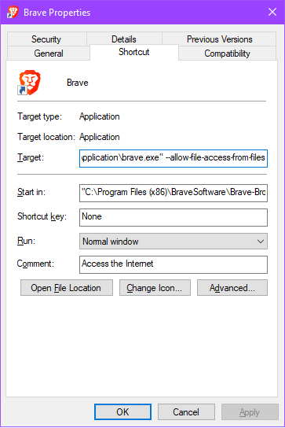
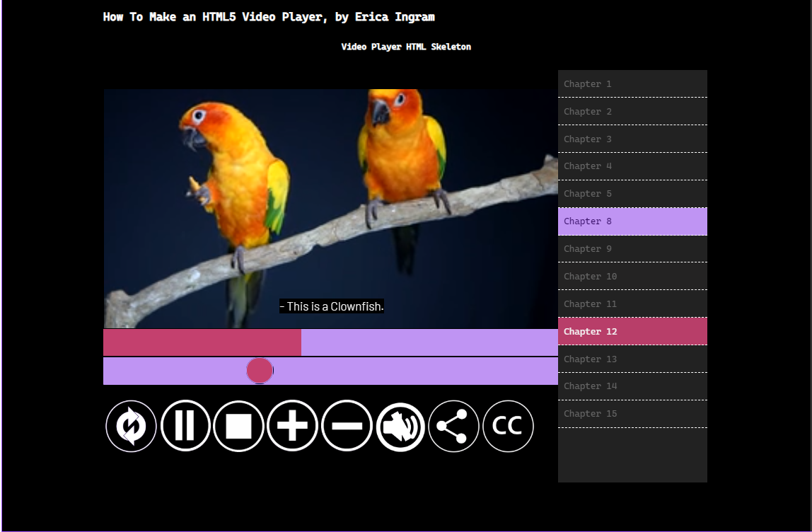

# How to Create an HTML5 Video Player for your Portfolio

I understand anybody might just come across this repo, but if you are a Lambda student or staff, I ask that you please don't share this with the general public.   Lambda folks need every leg up they can get!

## Table of Contents

- [Notes](#Notes)
- [What You Need](#What-You-Need)
- [Directions for Creating HTML5 Video Player](#Directions-for-Creating-HTML5-Video-Player)
  - [Setup](#Setup)
  - [index.html Part 1](#index.html-Part-1)
  - [index.js](#index.js)
  - [Browser Flag](#Browser-Flag)
  - [index.html Part 2](#index.html-Part-2)
  - [media-player.js](#media-player.js)
- [Resources for Making a Video Player](#Resources-for-Making-a-Video-Player)

## Notes

- All SVGs were downloaded from Pixabay and are in Creative Commons, so you are free to do w/e with them.  They are not mine.
- The button template files are created by me, but you are free to do whatever with it.  It's just a base you can use to start making a button, although of course you don't have to use it if you don't want to.

## What You Need

- your favorite coding editor
- photo editing software (making buttons, nothing major)

## Directions for Creating HTML5 Video Player

### Setup

- Set up your new repo for this project.  
- Create folders within it named ```css```, ```js```, ```img```, and ```fonts```.
- Download the fonts you want to use for this player and put them in the ```fonts``` folder.
- In the main directory, make an ```index.html``` skeleton which you will be editing later.
- In the ```css``` folder, create three files:  ```index.css```, ```media-player.css```, and ```subtitles.css```.
- In the ```js``` folder, create two files:  ```index.js``` and ```media-player.js```.
- in the ```img``` folder, create two files:  ```captions.vtt``` and ```chapters.vtt``` (make a text file and just change the whole thing, including extension).  These two files ***MUST*** be the ***same directory*** as your video files, no exceptions!!
- Create and style your button images with your favorite photo editing software.  Again, the button template files are just a base you can use to start making a button, although of course you don't have to use it if you don't want to.  
  - There are also white SVGs provided for the middle portion of the button image from Pixabay if you would like to use those.  Once you get the player up and running, you will be able to use regular CSS to style the player in any way you want.

### index.html Part 1

- Next, you will want to open your ```index.html``` and add the following to the head:

```HTML
    <title>How To Make an HTML5 Video Player, by Erica Ingram</title>
    <meta charset="utf-8" />
    <meta name="viewport" content="width=device-width, initial-scale=1" />
    <meta http-equiv="X-UA-Compatible" content="ie=edge">
    <link rel="stylesheet" href="css/index.css" />
    <script src="js/index.js"></script>
    <link rel="stylesheet" href="css/media-player.css" />
    <link rel="stylesheet" href="css/subtitles.css" />
```

- If you are doing a portfolio, make sure you also add your avatar as a favicon and meta keywords/description in the head as well if you haven't already:

```HTML
    <link rel="icon" href="img/myAvatar.png" sizes="32x32" />
    <link rel="icon" href="img/myAvatar.png" sizes="192x192" />
    <link rel="apple-touch-icon-precomposed" href="img/myAvatar.png" sizes="180x180" />

    <meta name="keywords"
        content="HTML5 video player" />

    <meta name="description"
        content="skeleton for how-to on making a video player">
```

- Next, add your ```body``` tag with the following:

```HTML
<body>

        <!-- Header -->
        <header id="header">
            <h1>Video Player HTML Skeleton</h1>
        </header>

        <!-- Main -->
        <section id="main">
            <section class="video-section">
                <h2 id="video-player-title" class="video-player-title">Video Player HTML Skeleton</h2>
                <br />
            </section>
        </section>

        <!-- Footer -->
        <footer id="footer">
            <p>&copy; Created By Erica Ingram   |   <br />(425) 610-7447   |  me at ericaingram dot tech</p>
        </footer>

    <script src="js/media-player.js" ></script>
</body>
```

- Save it.
- So now we are going to write some JavaScript.  I'm not going to explain this part because ya'll learned it in school!
- Just inside your closing body tag in ```index.html```, add the following:

```HTML
    <script src="js/media-player.js" ></script>
    <script src="js/index.js"></script>
```

### index.js

- Then, in ```index.js```, add the following:

```JavaScript
var shareModal = document.getElementById("share-modal");
var shareButton = document.getElementById("share-button");
var shareSpan = document.getElementsByClassName("share-close")[0];

shareButton.onclick = () => {shareModal.style.display = "flex";}
shareSpan.onclick = () => {shareModal.style.display = "none";}

window.onclick = (event) => {if (event.target == shareModal) {shareModal.style.display = "none";}}
```

- Save and close ```index.js``` for now.

### Browser Flag

- ***VERY IMPORTANT***:  When you are working on this video player locally, make sure you have the following flag in the browser you are testing this in.  Right click on the app shortcut and go to properties, then add the flag to the ```target``` field at the end.  

IDK what this flag is on non-Chromium browsers, so you will have to research it on your own if you are not using a Chromium-based browser (new Edge, Chrome, Brave, etc.).  The reason for this is because, if you don't do it, it's going to not let you read chapter or caption VTT files locally later when you go to use them.  

Close and restart your browser once you've added the flag.

```pseudocode
--allow-file-access-from-files
```



### index.html Part 2

- Now we're going to go back to the ```index.html``` file and add the HTML code for the video, chapters, and subtitles.  Add the following under the ```<br />``` tag inside the ```video-section``` class section.  This part is going to hold your video player, its controls, and the HTML for the chapters and captions.

```HTML
<figure id='media-player' class="media-player">
    <div id="player-controls" class="player-controls">
        <div id='media-controls' class="media-controls">
        </div>
    </div>
    <div id='media-chapters'>
        <figcaption>
            <ol id="chapters" class="chapters">
            </ol>
        </figcaption>
    </div>
    <div id="share-modal" class="share-modal">
        <div class="share-modal-content">
            <div class="share-close">X</div>
            <div class="share-modal-body">
            </div>
        </div>
    </div>
</figure>
```

- Next we add the actual video player, which is the next code block.  Above the div with id ```media-controls```, inside the div with id ```player-controls```, add the video player.
- The first line of this section opens the video tag.  
- ```controls``` specifies that the video controls should be displayed.
- Preload ```auto``` specifies if and how the video should be loaded when the page loads.  You may select from ```auto```, ```metadata```, or ```none```.
- [Other possible attributes for the ```video``` tag](https://www.w3schools.com/TAgs/tag_video.asp).

<br />

- The second and third lines are the video's source, where to get the file and what type of file it is.  You may have only one of these if you have only one format of a certain video.  I put two here to show that you may have multiples if you wish.
- [Other possible attributes for the ```source``` tag](https://www.w3schools.com/TAgs/tag_source.asp).

<br />

- Then there are two tracks, one for chapters (the right-hand menu) and one for subtitles (closed captioning).
- ```kind``` specifies what type of text track it is.  The available options for this are ```captions```, ```chapters```, ```descriptions```, ```metadata```, or ```subtitles```.  So you will need two tracks if you want BOTH captions and chapters.
- ```label``` signifies the title of the text track.
- ```src``` specifies the URL to the file location of that track.
- ```srclang``` signifies the text data language, required if ```kind='subtitles'```.
- ```default``` being enabled means that, if the user's preferences do not say whether to turn it on or off, enable it.

<br />

- Close the video tag.

```HTML
<video
    id='media-video'
    controls
    preload="auto"
    class="media-video" >
    <source src='img/SampleVideo1.mp4' type='video/mp4'>
    <source src='img/SampleVideo1.webm' type='video/webm'>
    <track kind="chapters"
        label="Projects"
        src="img/chapters.vtt"
        srclang="en"
        onload="displayChapters(this)"
        default />  
    <track kind="subtitles"
        srclang="en"
        src="img/captions.vtt"  
        label="English"
        default >
</video>
```

- Next, below your closing ```</video>``` tag, still inside the div with id ```player-controls```, add the following.  This will contain the progress bar, the playback speed bar, and the actual player buttons.
- The progress bar is just an empty div with another empty div inside of it that will represent the filling portion of the progress bar after we've styled it with CSS.
- The input field here is the guts of the playback speed bar.  Its type is ```range``` and its ```min``` and ```max``` signify the max and min speeds you want the player to be able to play at.  ```step``` signifies how much each individual step should go up in the range, and ```value``` specifies what the range's value is currently set at.  So right now, the player will play at 1x speed, normal regular speed.
- Then we have an empty div representing what will shortly be the player buttons.

```HTML
<div id='media-controls' class="media-controls">
    <div class="progress">
        <div class="progress__filled"></div>
    </div>
    <input
        id="playbackSpeed"
        type="range"
        name="playbackRate"
        class="player__slider"
        min="0.5"
        max="2"
        step="0.1"
        value="1">
    <div id="media-buttons" class="media-buttons">
    </div>
</div>
```

- Next, we'll add the actual buttons inside the div with id ```media-buttons```, each with their own onclick attribute to run the respective function on click.  Ensure each image has an ```alt``` attribute.  Notice there is a button for each of ```replay```, ```play/pause```, ```stop```, ```volume up```, ```volume down```, ```mute/unmute```, ```share```, and ```cc```, and six of the eight each run a separate function, which we will write shortly.

```HTML
<div id='replay-button' class='replay icon'
    title='replay' onclick='replayMedia();'>
    
</div>
<div id='play-pause-button' class='play icon'
    title='play' onclick='togglePlayPause();'>
    
</div>
<div id='stop-button' class='stop icon'
    title='stop' onclick='stopPlayer();'>
    
</div>
<div id='volume-inc-button' class='volume-plus icon'
    title='increase volume' onclick='changeVolume("up");'>
    
</div>
<div id='volume-dec-button' class='volume-minus icon'
    title='decrease volume' onclick='changeVolume("down");'>
    
</div>
<div id='mute-button' class='mute icon'
    title='mute' onclick='toggleMute("true");'>
    
</div>
<div id='share-button' class='icon'
    title='share on social media'>
    
</div>
<div id='cc-button' class='icon'
    title='closed captioning'>
    
</div>
```

- Now to the last portion of HTML; inside of the div with class ```share-modal-body```, paste your share icons w/ links, the following code.  Now, you will not want to use the links I have provided here because they will post my website to social media, but you may generate some of your own at [this link](http://www.sharelinkgenerator.com/).

```HTML
<div id='facebook' 
    title='Share on Facebook'>
        <a href="https://www.facebook.com/sharer/sharer.php?u=http%3A//www.ericaingram.com" target="_blank"  rel="noopener noreferrer">
        
    </a>
</div>
<div id='twitter'
    title='Share on Twitter'>
    <a href="https://twitter.com/intent/tweet?text=Check%20out%20this%20cool%20project%20walkthrough%20and%20custom%20video%20player%20by%20Erica%20Ingram%20at%20http%3A//www.ericaingram.com." target="_blank"  rel="noopener noreferrer">
        
    </a>
</div>
<div id='linkedin'
    title='Share on LinkedIn'>
    <a href="https://www.linkedin.com/shareArticle?mini=true&url=http%3A//www.ericaingram.com&title=Cool%20Project%20Walkthrough%20%26%20Custom%20Video%20Player&summary=Check%20out%20this%20cool%20project%20walkthrough%20and%20custom%20video%20player%20by%20Erica%20Ingram.&source=" target="_blank"  rel="noopener noreferrer">
        
    </a>
</div>
<div id='email'
    title='Share via email' >
    <a href="mailto:?subject=cool%20project%20walkthrough%20%26%20custom%20video&body=Check%20out%20this%20cool%20project%20walkthrough%20and%20custom%20video%20player%20by%20Erica%20Ingram%20at%20http%3A//www.ericaingram.com." target="_blank"  rel="noopener noreferrer">
    
    </a>
</div>
```

- Save and close ```index.html``` for now.  

### media-player.js

Now, we're going to write some JavaScript code.  First, in ```js/media-player.js```, we need to initialize some variables and select some DOM elements on the page via ```getElementById```, ```querySelectorAll```, and ```querySelector```.  If you need to, this is a good place to stop and compare these to what's in ```index.html``` so you understand what each one is looking for on the page.  Since you already covered this in school, that's all I'll say about it.

```JavaScript
document.addEventListener("DOMContentLoaded",
    () => { initializeMediaPlayer(); }, false);

var mediaPlayer;

var stopBtn = document.getElementById('stop-button');
var muteBtn = document.getElementById('mute-button');

const player = document.querySelector('#media-player');
const video = player.querySelector('#media-video');
const toggle = player.querySelector('#play-pause-button');
const progress = player.querySelector('.progress');
const progressBar = player.querySelector('.progress__filled');
const speedRanges = player.querySelectorAll('.player__slider');

var playPauseBtn = document.getElementById('play-pause-button');
```

- You also need several functions in ```media-player.js```:

  - one to initialize the media player:

    - This function turns off the controls and adds quite a few event listeners as well as space-bar play/pause toggle functionality to the player.

    ```JavaScript
    initializeMediaPlayer = () => {
        mediaPlayer = document.getElementById('media-video');

        mediaPlayer.controls = false;

        mediaPlayer.addEventListener('timeupdate', updateProgressBar, false);

        playPauseBtn.addEventListener('click', () => {
            changeButtonType(playPauseBtn, 'pause');}, false);

        playPauseBtn.addEventListener('click', () => {
            changeButtonType(playPauseBtn, 'play');}, false);

        muteBtn.addEventListener('click', () => {
            changeButtonType(muteBtn, 'unmute');}, false);

        muteBtn.addEventListener('click', () => {
            changeButtonType(muteBtn, 'mute');}, false);

        mediaPlayer.addEventListener('ended', () => {
            this.pause(); }, false);

        video.addEventListener('click', togglePlayPause);
        video.addEventListener('play', changeButtonType);
        video.addEventListener('pause', changeButtonType);
        video.addEventListener('timeupdate', handleProgress);

        speedRanges.forEach(range => range.addEventListener('change', handleRangeUpdate));
        speedRanges.forEach(range => range.addEventListener('mousemove', handleRangeUpdate));

        let mousedown = false;

        progress.addEventListener('click', scrub);
        progress.addEventListener('mousemove', ()=> mousedown && scrub);
        progress.addEventListener('mousedown', () => mousedown = true);
        progress.addEventListener('mouseup', () => mousedown =false);
        progress.addEventListener('change', handleProgress);

        window.onkeyup = (e) => {if(e.keyCode == 32){togglePlayPause();}}
    }
    ```

  - one to toggle between play and pause:

    ```JavaScript
    togglePlayPause = () => {

        if (mediaPlayer.paused || mediaPlayer.ended) {
            changeButtonType(playPauseBtn, 'pause');
            mediaPlayer.play();
        }
        else {
            changeButtonType(playPauseBtn, 'play');
            mediaPlayer.pause();
        }
    }
    ```

  - one to toggle between mute and unmute:

    ```JavaScript
    toggleMute = () => {
        if (mediaPlayer.muted) {
            changeButtonType(muteBtn, 'mute');
            mediaPlayer.muted = false;
        }
        else {
            changeButtonType(muteBtn, 'unmute');
            mediaPlayer.muted = true;
        }
    }
    ```

  - one to stop the media player:

    ```JavaScript
    stopPlayer = () => {
        mediaPlayer.pause();
        mediaPlayer.currentTime = 0;
    }
    ```

  - one to change the volume:

    ```JavaScript
    changeVolume = (direction) => {
        if (direction === 'up') {
            mediaPlayer.volume += mediaPlayer.volume == 1 ? 0 : 0.1
        }
        else {
            mediaPlayer.volume -= (mediaPlayer.volume == 0 ? 0 : 0.1)
        };
        mediaPlayer.volume = parseFloat(mediaPlayer.volume).toFixed(1);
    }
    ```

  - one to replay the video:

    ```JavaScript
    replayMedia = () => {
        resetPlayer();
        mediaPlayer.play();
    }
    ```

  - one to update the progress bar:

    ```JavaScript
    updateProgressBar = () => {
        const percent = (video.currentTime / video.duration) * 100;
        progressBar.style.flexBasis = `${percent}%`;
    }
    ```

  - one to toggle appropriate button:

    ```JavaScript
    changeButtonType = (btn, value) => {
        if(btn && value){
            btn.title = value;
            var buttonImage;
            if(btn.classList.contains('play')){
                buttonImage = document.getElementById('play-img');
                buttonImage.src = "img/png/pause.png";
                btn.classList.add('pause');
                btn.classList.remove('play');
            }
            else if (btn.classList.contains('pause')){
                buttonImage = document.getElementById('play-img');
                buttonImage.src = "img/png/play.png";
                btn.classList.add('play');
                btn.classList.remove('pause');

            }
            if(btn.classList.contains('mute')){
                buttonImage = document.getElementById('mute-img');
                buttonImage.src = "img/png/unmute.png";
                btn.classList.add('unmute');
                btn.classList.remove('mute');
            }
            else if (btn.classList.contains('unmute')){
                buttonImage = document.getElementById('mute-img');
                buttonImage.src = "img/png/mute.png";
                btn.classList.add('mute');
                btn.classList.remove('unmute');

            }
        }
    }
    ```

  - one to reset the video player:

    ```JavaScript
    resetPlayer = () => {
        progressBar.value = 0;
        video.currentTime = 0;
        changeButtonType(playPauseBtn, 'play');
    }
    ```

  - one to handle the range on the input field changing or process progress bar changes.  Note this one cannot use an arrow function since it uses the ```this``` keyword.

    ```JavaScript
    function handleRangeUpdate() {
        video[this.name] = this.value;
    }
    ```

  - one to make sure the progress bar displays the actual video progress:

    ```JavaScript
    handleProgress = () => {
        const percent = (video.currentTime / video.duration) * 100;
        progressBar.style.flexBasis = `${percent}%`;
    }
    ```

  - one to enable clicking on progress bar to view from that point forward in the video:

    ```JavaScript
    scrub = (e) => {
        const scrubTime = (e.offsetX / progress.offsetWidth) * video.duration;
        video.currentTime = scrubTime;
    }
    ```

- Now, we'll work on the captions and chapters.  Directly above the function ```initializeMediaPlayer``` in ```media-player.js```, add the following:

```JavaScript
// initialize text track variable
var textTrack;

// save closed caption toggle button to a variable
var subtitleButton = document.getElementById('cc-button');

// initialize variable that will later hold the subtitles
var subtitles;

//
for (var i = 0; i < video.textTracks.length; i++) {
    if(video.textTracks[i].kind = 'subtitles'){
        video.textTracks[i].mode = 'hidden';
        subtitles = video.textTracks[i];
    }
}

// 
subtitleButton.addEventListener('click', (e) => {
    if (subtitles) {subtitles.mode = (subtitles.mode == 'showing' ? 'hidden' : 'showing');}
});
```

- Add the following to the bottom of ```media-player.js```.

```JavaScript
// 
var chapterList = document.getElementById("chapters");
// 
var trackElement = video.getElementsByTagName("track")[0];
```

- Now, right above the two lines you just put at the bottom of ```media-player.js```, add a function to display chapters.

```JavaScript
// function to display chapters; since it uses the 'this' keyword, we can't put it in arrow form.
function displayChapters(trackElement) {
    // We only want it to do things if there is at least one text track
    if ((trackElement) && (textTrack = trackElement.track)){
        // We only want it to do things if chapters exist in the text tracks
        if (textTrack.kind === "chapters"){
            // Hide the chapters for the time being; we are going to unhide them a little bit further down.
            textTrack.mode = 'hidden';
            // loop through each individual chapter and add it to the ordered list with id 'chapters' in index.html
            for (var i = 0; i < textTrack.cues.length; ++i) {
                // get the individual chapter, its text, and start time
                cue = textTrack.cues[i],
                chapterName = cue.text,
                start = cue.startTime,
                // create an li for it and set its id as its start time
                newChapterListItem = document.createElement("li");
                newChapterListItem.setAttribute('id', start);
                // create text node for chapter description
                var chapterDescription = document.createTextNode(cue.text);
                // append the description text node to the individual chapter item
                newChapterListItem.appendChild(chapterDescription);
                // append individual chapter item to chapter list
                chapterList.append(newChapterListItem);
                // now, get the list and items in the DOM so we can add a click event listener to them
                var chaptersList = document.getElementById('chapters');
                var chaptersListItems = chaptersList.getElementsByTagName('li');
                // loop through li items and add click event listener
                for (let x = 0; x < chaptersListItems.length; x++){
                    chaptersListItems[x].addEventListener("click", () => {
                        document.getElementById('media-video').currentTime = chaptersListItems[x].id;
                        chaptersListItems[x].style.textShadow = "-1px 1px 0 #340a67, 1px 1px 0 #340a67, 1px -1px 0 #340a67; -1px -1px 0 #340a67";
                    }, false);
                    // styling for individual chapter items on right-hand side
                    chaptersListItems[x].style.fontFamily = 'Cascadia';
                    chaptersListItems[x].style.padding = '4%';
                }
            }
        // add 'current' css class to 'current' chapter, also remove it from chapters that aren't 'current'
        // can't be an arrow function because of 'this' keyword
        textTrack.addEventListener("cuechange",
            function() {
                var currentChapter = this.activeCues[0].startTime;
                if (chapter = document.getElementById(currentChapter)) {
                    var locations = [].slice.call(document.querySelectorAll("#chapters li"));
                    for (var i = 0; i < locations.length; ++i) {locations[i].classList.remove("current");}
                    chapter.classList.add("current");
                    chapterList.style.top = "-"+chapter.parentNode.offsetTop+"px";
                }
            }, false);
        }
    }
}
```

- Now you should have a working player!



## Resources for Making a Video Player

- [Social Media Sharing Link Generator](http://www.sharelinkgenerator.com/)
- [Day 11 of JavaScript 30](https://javascript30.com/) by Wes Bos has a different style of video player; if you want to take a look at it, it's free.
- [Different How-To 1](http://thenewcode.com/977/downtown-los-angeles-locations.vtt) for creating a video player with chapters
- [Different How-To 2](https://www.brightcove.com/en/blog/2016/01/how-chapterize-your-videos-using-webvtt-files) for creating a video player with chapters; shows samples of WebVTT files
- [Different How-To 3](https://www.rev.com/blog/resources/how-to-add-captions-and-subtitles-to-html5-videos) for creating a video player with captions
- [Different How-To 4](https://developer.mozilla.org/en-US/docs/Web/Guide/Audio_and_video_delivery/Adding_captions_and_subtitles_to_HTML5_video) for creating a video player with captions with additional languages
- [How To Create A WebVTT File](https://www.3playmedia.com/2017/06/30/how-to-create-a-webvtt-file/) for learning syntax of WebVTT files
