# Minor Video Editing Tasks in Premiere Pro

I understand anybody might just come across this repo, but if you are a Lambda student or staff, I ask that you please don't share this with the general public.   Lambda folks need every leg up they can get!

## Table of Contents

- [Notes](#Notes)
- [What You Need](#What-You-Need)
- [Video Editing Tasks](#Video-Editing-Tasks)
  - [How to Cut From Video](#How-to-Cut-From-Video)
  - [How to Insert a Clip](#How-to-Insert-a-Clip)
  - [How to Insert a Picture](#How-to-Insert-a-Picture)
  - [How to Crop a Video](#How-to-Crop-a-Video)
  - [How to Export the Video](#How-to-Export-the-Video)

## Notes

Let's say you have a video, and you want to make some minor edits to it.  This portion of the how-to is focused on Premiere Pro, but there are many other video-editing software options out there, so feel free to use the one you're most comfortable with.  This is the one I know how to do a few things in, so this is the one I am showing you how to work in.

## What You Need

- your recorded video clip(s)
- Premiere Pro

## Video Editing Tasks

- Open Premiere Pro.  It will take a while to open.

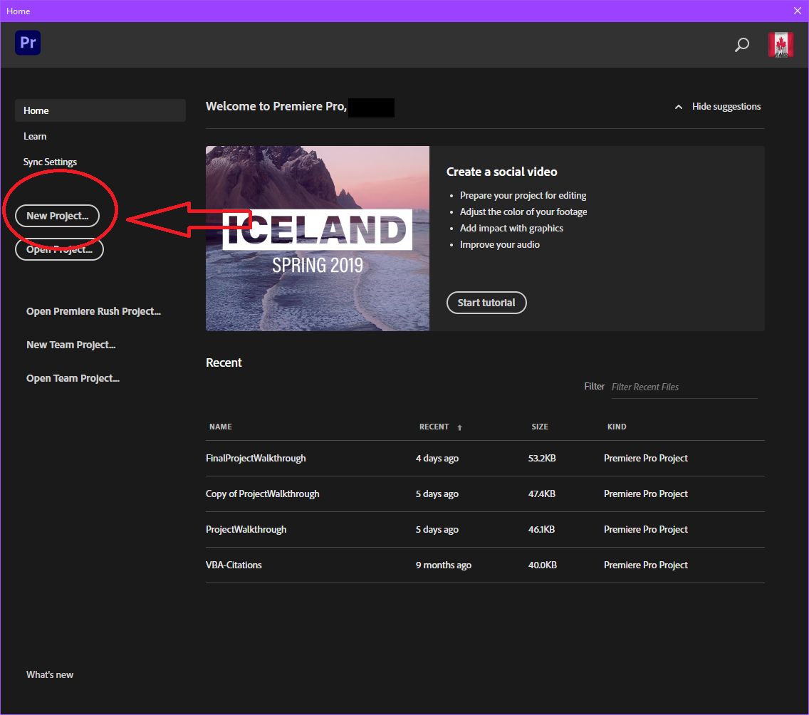

- Click ```New Project``` towards the top left.

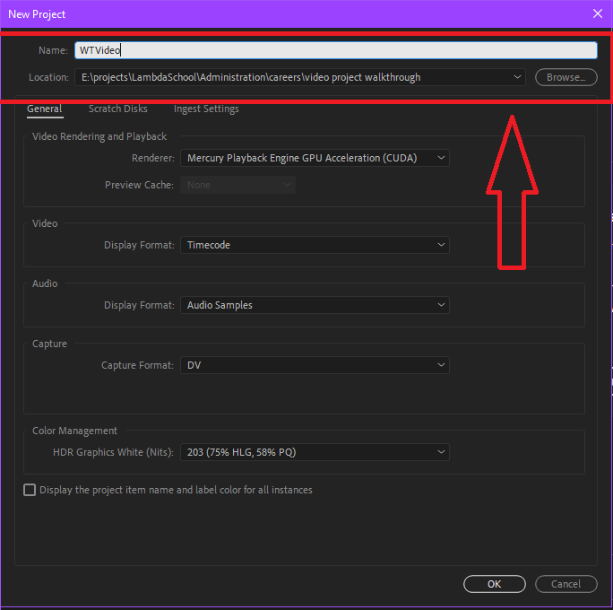

- Type in the name you want for your project and desired file location.
- It will take a while to finish opening.

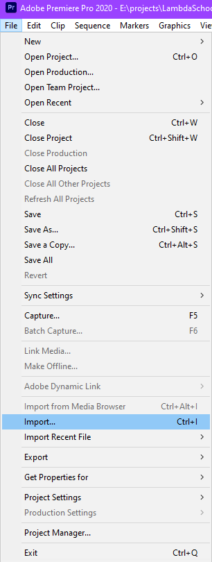

- Click ```File``` --> ```Import``` --> select the video you want to import into the project.
- The video you imported should now display in the bottom-left window, also known as your media browser, which is your list of source files.
- Click on the video down in that bottom-left window.  It will appear in the window above the ```media browser```.
- What you'll be doing here in the big picture is creating a sequence of clips from your video(s), and eventually you will encode or export that sequence.  That export will become the video you show in your HTML5 video player.

### How to Cut From Video

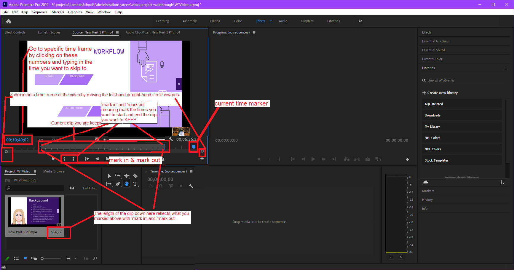

- Click ```Mark In``` where you want to START the first clip you want to KEEP, the curly bracket with the pointy end facing left and out facing right.
- Click ```Mark Out``` where you want to END the first clip you want to KEEP, the curly bracket with the pointy end facing right and out facing left.

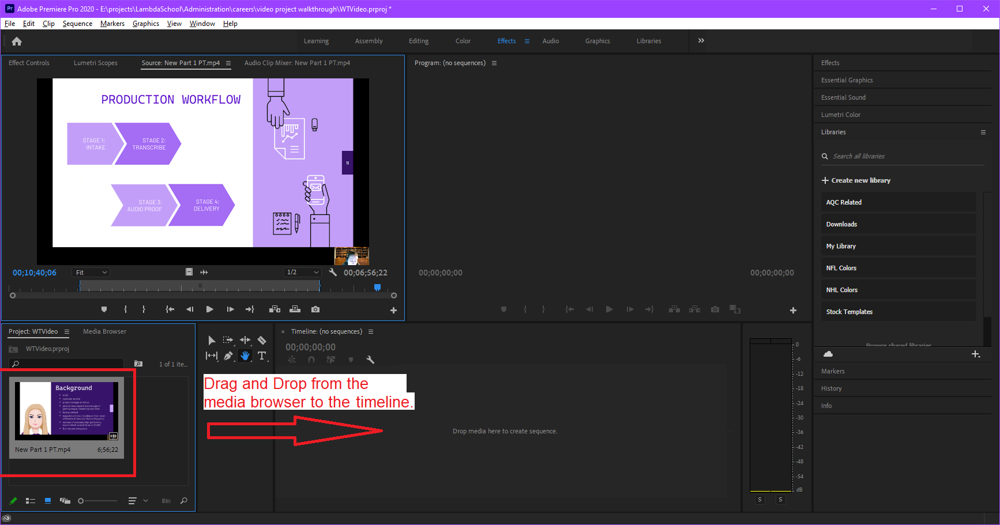

- After you have marked (both in and out) the first clip you want to keep, in the ```media browser```, drag and drop the clip there from the ```media browser``` to the timeline.

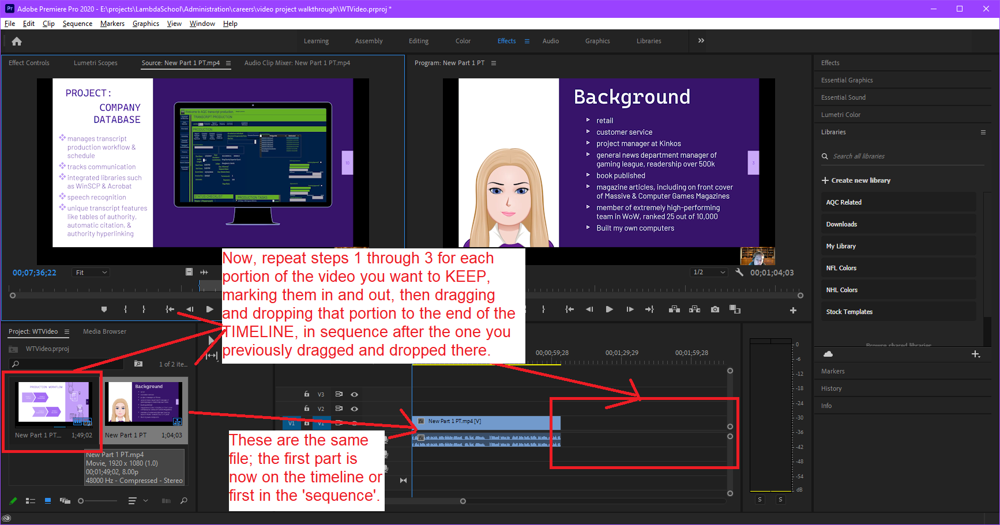

- Skip the parts you do NOT want in your video, but repeat the previous three steps for each part in the video you want to keep.  Mark it in, mark it out, drag the clip to the timeline in sequence AFTER the one you just did previously.
- The timeline has a snap feature, so if you drag it close to the end of the last clip, the one you're dragging will snap to the last clip.

### How to Insert a Clip


- Click ```File``` --> ```Import``` --> select the video you want to import into the project.
- The video you imported should now display in the bottom-left window, also known as your media browser, which is your list of source files.
- Now you can cut portions of it like you did before in the previous section or simply drag and drop it onto the timeline in sequence.

### How to Insert a Picture

- This is how you can use a black box to cover up info in a video or put a picture in a video, such as your avatar.


- Click ```File``` --> ```Import``` --> select the picture you want to import into the project.
- The picture you imported should now display in the bottom-left window, also known as your media browser, which is your list of source files.

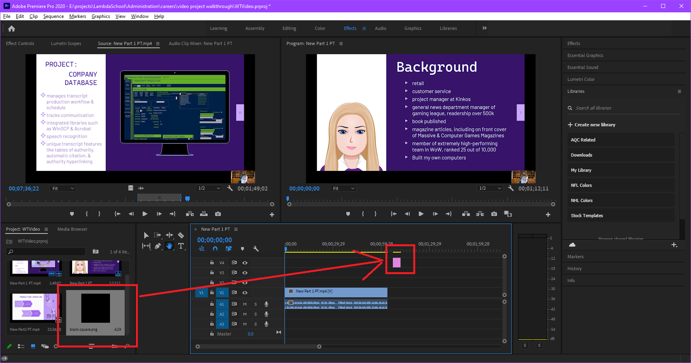

- Drag and drop it into the timeline up above the ```v1```, ```v2```, and ```v3``` lines there.

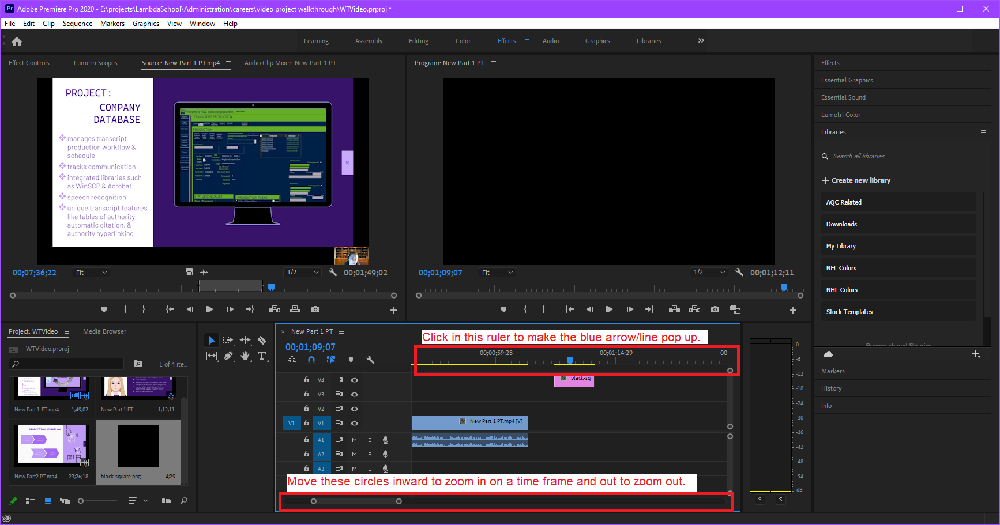

- Click anywhere in the ruler at the top of the timeline to make the blue line with the arrow attached pop up.
- Now, as you did with the other window, zoom in to that portion of the timeline by moving the little circles at the bottom of the timeline inward toward each other.  This will make the time selection more detailed and finer.

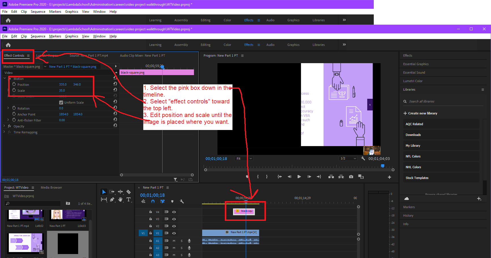

- Now, the pink box represents the image.  It is on the top layer of the video sequence, which means it will be displayed on top of anything else you have in the sequence.  You can change the time it's displayed by left-click and holding the left or right side of the pink box and moving it to the time you want it to be.
- Now, if you want this picture to not take up the whole screen, select the pink box and, in the top left area, click ```Effect Controls```.  Change the position and scale until it's placed how you want it.

### How to Crop a Video

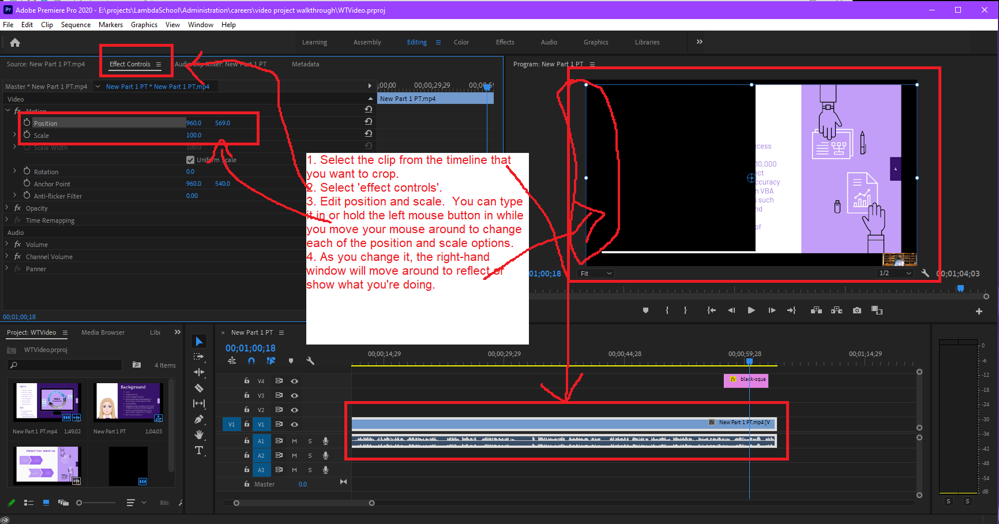

- You will need to do this part for each portion in your timeline, BUT once you have the position and scale numbers the first time, you can repeat it quite easily by typing in the position and scale numbers for all the other clips in the sequence. In the timeline, click the first clip you want to crop.
- Click ```effect controls```.
- Edit position and scale.  You can either type it in or you can hold the left mouse button down while moving your mouse around to change each of the position and scale options.  
- As you change it, the right-hand window will move around to reflect the changes you are making.
- Make note of the position and scale numbers you end up with for the first clip.
- Select the second clip in the timeline, then ```effect controls```, and enter the numbers you noted for position and scale.
- Repeat for each remaining clip in the timeline.

### How to Export the Video

- You made it!  Yay!
- Left-click anywhere inside the timeline.
- Select all files in the timeline by hitting Ctrl + A.

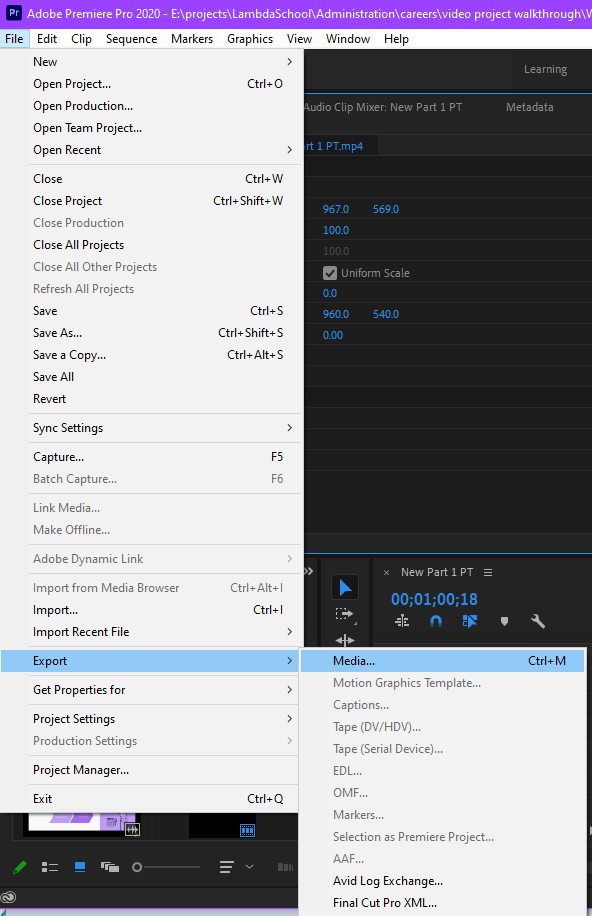

- Click ```File``` --> ```Export``` --> ```Media```.


- At the bottom on the left-ish side, for ```source range```, ensure ```entire sequence``` is selected.
- Select format 'H.264' for mp4 format.
- Ensure output name is what you want it to be.  If it's the wrong name or path, left-click on the blue name to have it prompt you for a name and proper location to save the exported file.  DO NOT save this video in your GitHub repo!  Size on files for GitHub are limited to 100mb.
- Click ```queue```.

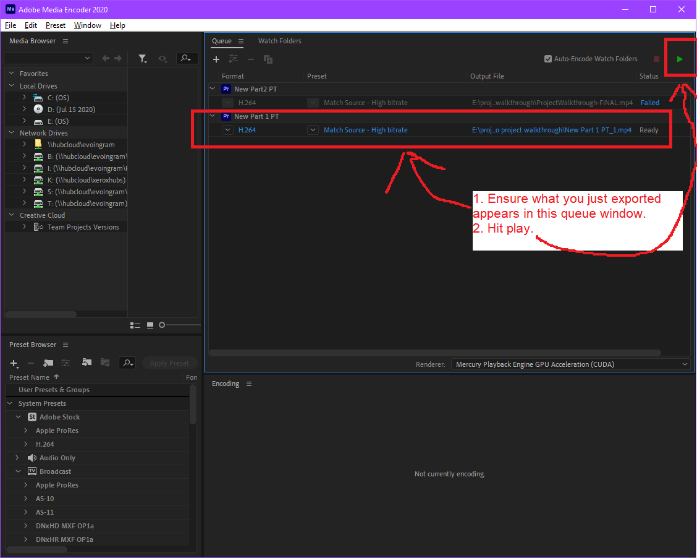

- Wait for the Adobe Media Encoder to open.  
- Once it's open, you should eventually see an item in the queue on the right, which is what you just exported.
- Hit play and wait for it to get done.
- Once you see your item in the queue, you can save and close your Premiere Pro project.
- When it's done, check the output folder you specified earlier and there's your video!
